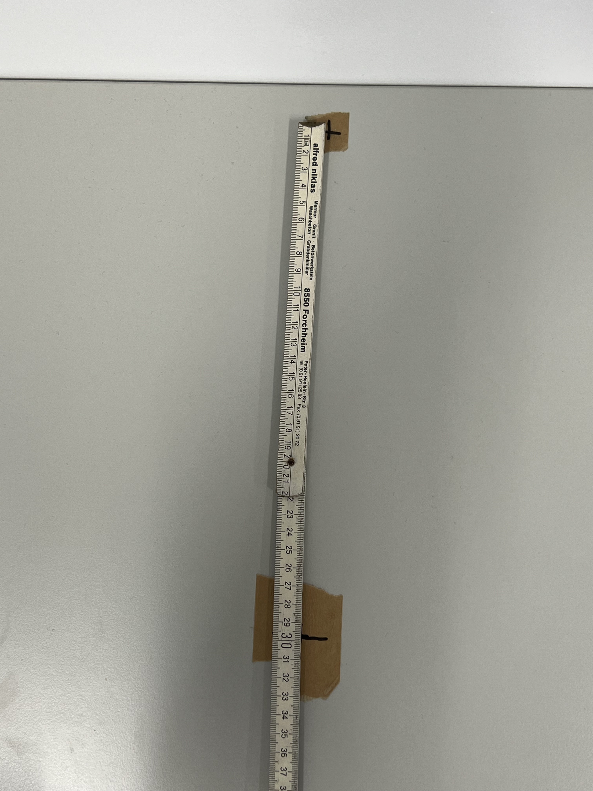

# **Bottle Dataset with Labeled Pellet Counts**

## **Overview**

This dataset features images of small bottles containing red, green, and blue pellets, each labeled with the precise count of pellets for each color. Most images were taken against a white background (white wall and ground), ensuring consistent conditions. Additionally, the dataset includes approximately 300 images captured in diverse environments to enhance variability.


## **Dataset Structure**

The dataset is organized as follows:

    .
    ├── images_raw/          # .jpg files
    ├── images_cropped/      # .jpg images cropped to 224x224
    ├── labels/           	 # .json labels for the images
    └── README.md

## **Labels Format**

Each JSON file in the labels/ folder contains:

```
{
  "image_id": <image file name>,    // Name of the corresponding image file
  "red": <count>,                   // Number of red pellets
  "green": <count>,                 // Number of green pellets
  "blue": <count>                   // Number of blue pellets
}
```

### **Example Label**

For an image of a bottle with 5 red, 3 green, and 8 blue pellets:

```json
{
    "image_id": "img_20241125_082521.jpg",
    "red": 5,
    "green": 3,
    "blue": 8
}
```

## **Setup**

### **Environment**

- Artificial lighting with the window blinds closed

### **Camera Placement**

- The bottle is placed **right in front of** the wall
- The robot is placed **30cm** from the bottle
- Both are place **perpendicular** to the wall





## **Statistics**

- Total Images: 2,967
- Total Labels: 2,967
- Bottle Variants: 125 variants

